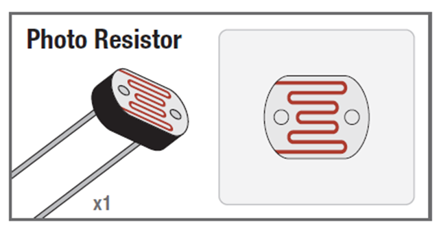

# Build a Theremin like musical instrument
In this lab we will build a musical instrument that is controlled with a photoresitor. The photoresistor will respond to the shadow of our hand, so we won't need to actually touch it to make it respond. In this way, it is like a [Theremin](https://en.wikipedia.org/wiki/Theremin), an electronic musical instrument that is played without touching it.
### Step 1: Build the circuit
Our Theremin will use the following parts:
- 10KΩ resistor
- Photoresistor
- 3 Jumper wires   

Use the picture below to make sure you are using correct 10KΩ resistor.   
   
The photoresistor has two leads of equal length. It is shown below:   
    
Use the following circuit diagram to construct the circuit. The direction of the photoresistor and the 10KΩ resistor is unimportant.   

### Step 2: Test the circuit
TBD

### Step 3: Write the program
TBD   
Feel free to modify your Theremin in any way you wish. Have fun and be creative, your Theremin doesn't have to work or sound like any other.

### Step 4: Submit your finished program
Have your teacher or a TA verify that you have a working program. Submit your finished program by uploading the .sb file to Google classroom. You should be able to find it in My Documents | Scratch Projects. If you worked with a partner, each partner should submit a copy of the finished program to Google classroom.
