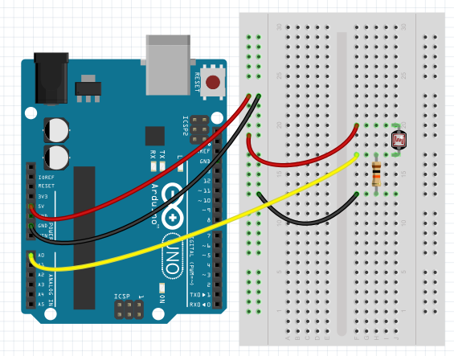
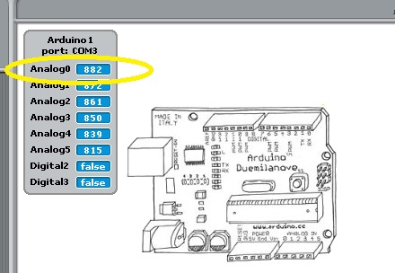
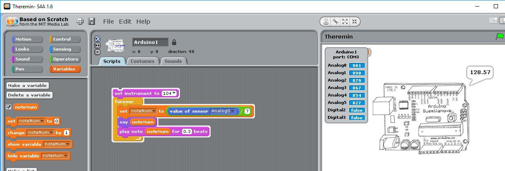

# Build a Theremin like musical instrument
In this lab we will build a musical instrument that is controlled with a photo resistor. The photo resistor will respond to the shadow of our hand, so we won't need to actually touch it to make it respond. This will create an instrument similar to a [Theremin](https://en.wikipedia.org/wiki/Theremin), an electronic musical instrument that is played without touching it.
### Step 1: Build the circuit
Our Theremin will use the following parts:
- 10KΩ resistor
- Photoresistor
- Jumper wires   

Use the picture below to make sure you are using correct 10KΩ resistor.   
   
The photoresistor has two leads of equal length. It is shown below:   
    
Use the following circuit diagram to construct the circuit. The direction of the photoresistor and the 10KΩ resistor is unimportant.   

### Step 2: Test the circuit
Test your circuit by using your hand to create a shadow over the photoresistor. A shadow should decrease the the value of the **Analog0** sensor. You can see the value of **Analog0** in the sensors display shown below.   

### Step 3: Write the program
We will use the input from the photoresistor to play a note number on one of scratch's built in musical instruments from the Sound tab. The numbers generated by the the sensor are larger than ideal for musical notes, so use a `/` (division operator) block to decrease the sensor values. You may find it convienant to use a variable to store the note number. Here is one possible program:   
   
Feel free to modify your theremin circuit or code in any way you wish. Have fun and be creative, your theremin doesn't have to work or sound like any other.

### Step 4: Submit your finished program
Have your teacher or a TA verify that you have a working program. Submit your finished program by uploading the .sb file to Google classroom. You should be able to find it in *My Documents | Scratch Projects*. If you worked with a partner, each partner should submit a copy of the finished program to Google classroom.

### Step 5: Save your circuit!
We are going to use the same resistor and photoresistor conifiguration in the next lab
